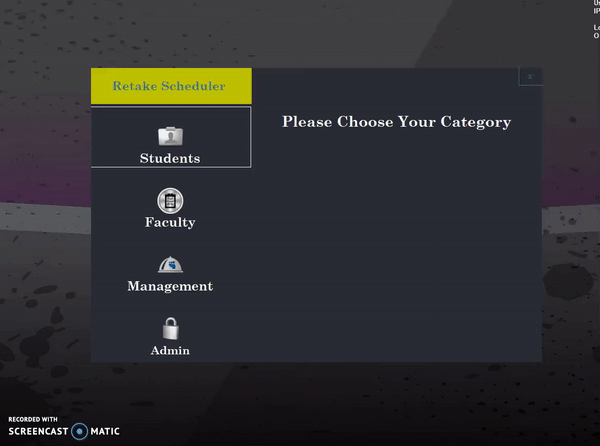
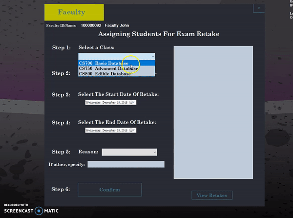
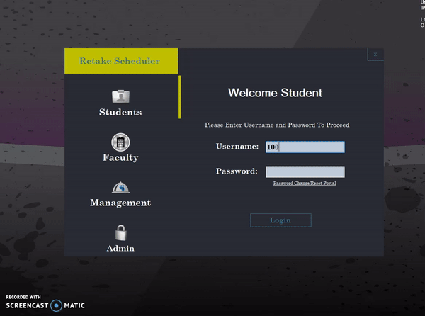
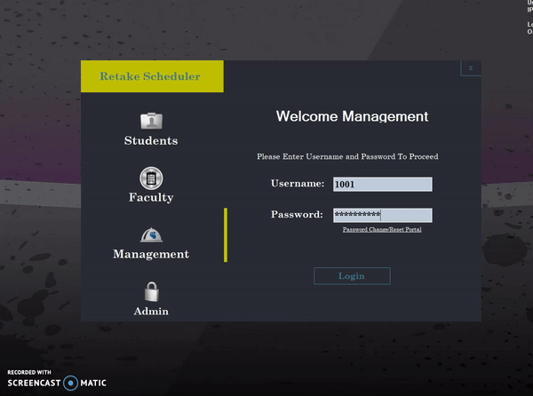
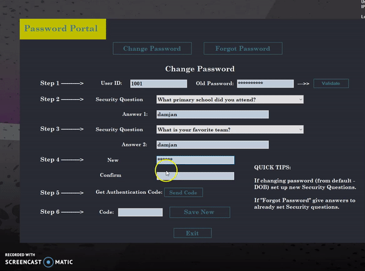
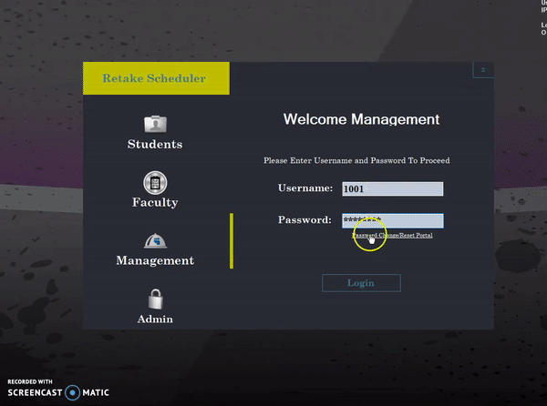

# examRetakeScheduler
Instructor creates Exam Retake (time span) for certain students. This gets registered in the Datatase (MS SQL Server). Students receive email containing all the informaiton regarding the retake (class, instructor, dates and time).

Students then need to schedule the retake.

All Users are forced to change the default password on first login. One-time authentication code is sent to the email address on file. Therefore implementing 2FA.

When studet comes in to complete the retake. The retake status gets updated to Completed, and the class instructr receives an email confirming the retake has been taken. 

